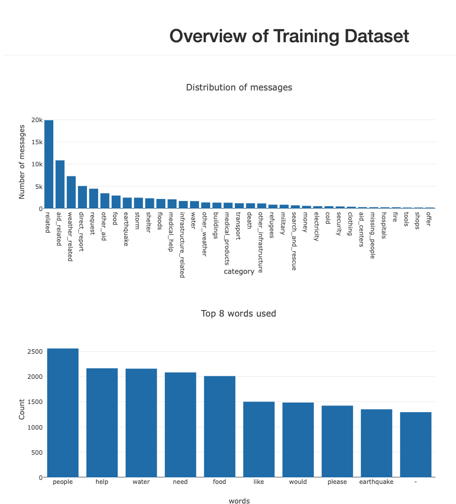
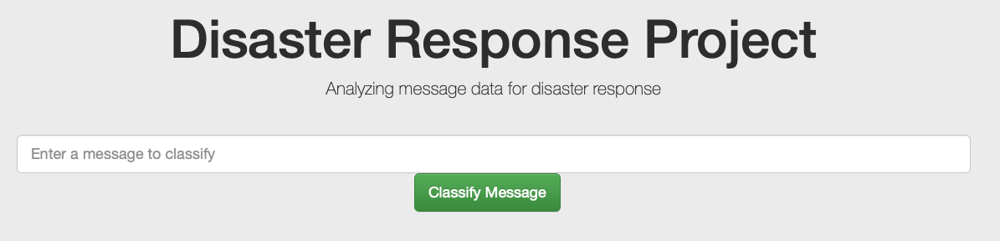
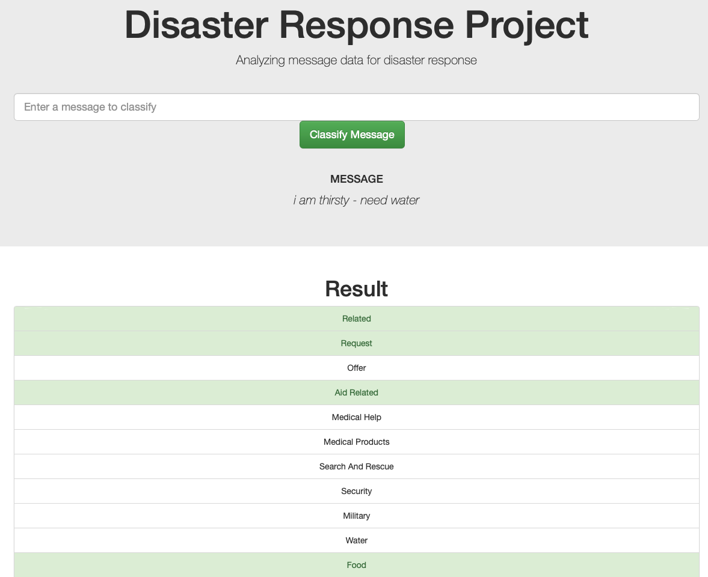

# Disaster Response Pipeline Project

### Table of Contents

1. [Installation](#installation)
2. [Project Motivation](#motivation)
3. [File Descriptions](#files)
4. [Instructions](#instructions)
5. [Results](#results)
6. [Licensing, Authors, and Acknowledgements](#licensing)

## Installation 

All of the requirements to run the application are captured in the requirements.txt

## Project Motivation

The goal of the project is to apply data engineering skills to analyze the [Disaster Response Messages](https://www.figure-eight.com/dataset/combined-disaster-response-data/) dataset provided by Figure Eight, and build a web application that can help emergency workers analyze incoming messages. They get sorted into specific categories to speed up aid and contribute to more efficient distribution of people and other resources.

## File Descriptions 

This project consists of three parts:

<h3> 2. ETL Pipeline </h3>
<ul>- Loads the datasets</ul>
<ul>- Merges the two datasets</ul>
<ul>- Cleans the data</ul>
<ul>- Stores it in a SQLite database</ul>

<h3> 2. ML Pipeline </h3>
<ul>- Loads data from the SQLite database</ul>
<ul>- Splits the dataset into training and test sets</ul>
<ul>- Builds a text processing and machine learning pipeline</ul>
<ul>- Trains and tunes a model using GridSearchCV</ul>
<ul>- Outputs results on the test set</ul>
<ul>- Exports the final model as a pickle file</ul>
    
<h3> 3. Web app </h3>
The web app displays visualization of the dataset that was used for training and validation of the ML-Pipeline.
    

    
The emergency worker can input a message in the web app. By hitting the 'Classify-Message'-button, you get classification results in several categories
    
    

You can find the file structure below:
<pre>
- app
| - template
| |- master.html  # main page of web app
| |- go.html  # classification result page of web app
|- run.py  # Flask file that runs app

- data
|- disaster_categories.csv  # data to process 
|- disaster_messages.csv  # data to process
|- process_data.py # performs ETL process
|- InsertDatabaseName.db   # database to save clean data to

- img #images used for README

- models
|- train_classifier.py #performs ML process
|- classifier.pkl  # saved model 

-requirements.txt #required installtions to run the process

- README.md
</pre>

## Instructions

1. Run the following commands in the project's root directory to set up your database and model.

    - To run ETL pipeline that cleans data and stores in database
        `python data/process_data.py data/disaster_messages.csv data/disaster_categories.csv data/DisasterResponse.db`
    - To run ML pipeline that trains classifier and saves
        `python models/train_classifier.py data/DisasterResponse.db models/classifier.pkl`

2. Run the following command in the app's directory to run your web app.
    `python run.py`

3. Go to http://0.0.0.0:3001/

## Results

The created web app can classify emergency texts.
The emergency worker can input a message in the web app, looking like this:

By hitting the 'Classify-Message'-button, you get classification results in several categories:

## Licensing, Authors, Acknowledgements

Must give credit to [FigureEight](https://www.figure-eight.com) for the data and Udacity for preparation for the flask web app.

Otherwise, feel free to use the code here as you would like! 